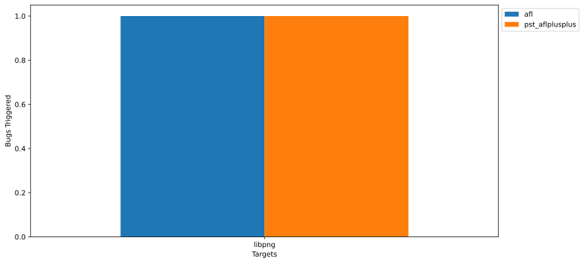
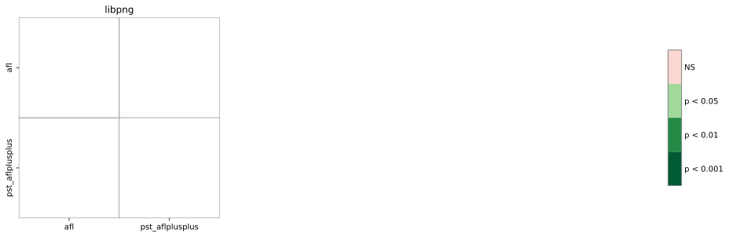



    <h1>Experiment Configuration</h1>
    <ul class="browser-default">
        <li><b>Duration</b>: 6h</li>
        <li><b>Trials</b>: 2</li>
        <li><b>Version</b>: v1.0</li>
    </ul>

    <h1>Fuzz Targets</h1>
    
This report summarizes the results of fuzzing the following targets:

    <ul id="target-list" class="browser-default">
        <li><a href="targets/libpng.html">libpng</a></li>  
    </ul>

    <h1>Evaluated Fuzzers</h1>
    
The fuzzers used in this evaluation are listed below:

    <ul id="fuzzer-list" class="browser-default">
        <li><a href="fuzzers/afl.html">afl</a></li>
        <li><a href="fuzzers/pst_aflplusplus.html">pst_aflplusplus</a></li>
    </ul>

<!--
EXPERIMENT PARAMETERS WILL BE LISTED HERE
-->

    <h1>Experiment Summary</h1>
    

        <h2>Total Unique Bugs Triggered</h2>
        <ul class="collapsible popout">
            <li>
                

                    <h3>Mean and Standard Deviation</h3>
                

                

                    This plot shows the mean number of unique bugs triggered by every fuzzer against every target,
                    and the standard deviation bar, across all campaigns.
                

            </li>
        </ul>
        
        <ul class="collapsible popout">
            <li>
                

                    <h3>Stastistical Significance</h3>
                

                

                    This matrix summarizes the p-values of the pairwise Mann-Whitney U tests calculated against the
                    total bug count sample sets collected for every fuzzer across all campaigns. Cells with a green
                    shade indicate that the number of bugs triggered by a fuzzer is statistically different.
                

            </li>
        </ul>
        
    

    

        <h2>Mean Survival Time</h2>
        <ul class="collapsible popout">
            <li>
                

                    <h3>Ranking of Bugs and Fuzzers</h3>
                

                

                    This table shows the restricted mean survival time for every bug being reached or triggered over the
                    duration of the campaign, using the Kaplan-Meier non-parametric survival function estimator.
                    Green-shaded cells indicate the best performance (lowest time) for a bug metric across all fuzzers.
                    Yellow-shaded cells indicate the worst performance (highest time) for a bug metric across all fuzzers.
                    Red-shaded cells indicate that the bug survived being reached or triggered by the fuzzer throughout
                    the campaign duration.
                

            </li>
        </ul>
        

            <a id="btn-colormap" class="btn-small waves-effect waves-light" style="margin-bottom: 10px; color: white; font-weight: normal;">
                <i class="material-icons left">color_lens</i>
                Change Colormap
            </a>
        

        
        <link id="survival_stylesheet" rel="stylesheet" href="css/survival_hiliter.css">
        
<table id="T_survival_table">
  <thead>
    <tr>
      <th class="index_name level0" >Fuzzer</th>
      <th id="T_survival_table_level0_col0" class="col_heading level0 col0" colspan="2">afl</th>
      <th id="T_survival_table_level0_col2" class="col_heading level0 col2" colspan="2">pst_aflplusplus</th>
    </tr>
    <tr>
      <th class="index_name level1" >Metric</th>
      <th id="T_survival_table_level1_col0" class="col_heading level1 col0" >R</th>
      <th id="T_survival_table_level1_col1" class="col_heading level1 col1" >T</th>
      <th id="T_survival_table_level1_col2" class="col_heading level1 col2" >R</th>
      <th id="T_survival_table_level1_col3" class="col_heading level1 col3" >T</th>
    </tr>
    <tr>
      <th class="index_name level0" >Bug ID</th>
      <th class="blank col0" >&nbsp;</th>
      <th class="blank col1" >&nbsp;</th>
      <th class="blank col2" >&nbsp;</th>
      <th class="blank col3" >&nbsp;</th>
    </tr>
  </thead>
  <tbody>
    <tr>
      <th id="T_survival_table_level0_row0" class="row_heading level0 row0" >PNG003</th>
      <td id="T_survival_table_row0_col0" class="data row0 col0" >10s</td>
      <td id="T_survival_table_row0_col1" class="data row0 col1" >15s</td>
      <td id="T_survival_table_row0_col2" class="data row0 col2" >10s</td>
      <td id="T_survival_table_row0_col3" class="data row0 col3" >20s</td>
    </tr>
    <tr>
      <th id="T_survival_table_level0_row1" class="row_heading level0 row1" >PNG001</th>
      <td id="T_survival_table_row1_col0" class="data row1 col0" >15s</td>
      <td id="T_survival_table_row1_col1" class="data row1 col1" >6h</td>
      <td id="T_survival_table_row1_col2" class="data row1 col2" >15s</td>
      <td id="T_survival_table_row1_col3" class="data row1 col3" >6h</td>
    </tr>
    <tr>
      <th id="T_survival_table_level0_row2" class="row_heading level0 row2" >PNG004</th>
      <td id="T_survival_table_row2_col0" class="data row2 col0" >15s</td>
      <td id="T_survival_table_row2_col1" class="data row2 col1" >6h</td>
      <td id="T_survival_table_row2_col2" class="data row2 col2" >15s</td>
      <td id="T_survival_table_row2_col3" class="data row2 col3" >6h</td>
    </tr>
    <tr>
      <th id="T_survival_table_level0_row3" class="row_heading level0 row3" >PNG005</th>
      <td id="T_survival_table_row3_col0" class="data row3 col0" >15s</td>
      <td id="T_survival_table_row3_col1" class="data row3 col1" >6h</td>
      <td id="T_survival_table_row3_col2" class="data row3 col2" >15s</td>
      <td id="T_survival_table_row3_col3" class="data row3 col3" >6h</td>
    </tr>
    <tr>
      <th id="T_survival_table_level0_row4" class="row_heading level0 row4" >PNG006</th>
      <td id="T_survival_table_row4_col0" class="data row4 col0" >15s</td>
      <td id="T_survival_table_row4_col1" class="data row4 col1" >6h</td>
      <td id="T_survival_table_row4_col2" class="data row4 col2" >15s</td>
      <td id="T_survival_table_row4_col3" class="data row4 col3" >6h</td>
    </tr>
    <tr>
      <th id="T_survival_table_level0_row5" class="row_heading level0 row5" >PNG007</th>
      <td id="T_survival_table_row5_col0" class="data row5 col0" >15s</td>
      <td id="T_survival_table_row5_col1" class="data row5 col1" >6h</td>
      <td id="T_survival_table_row5_col2" class="data row5 col2" >15s</td>
      <td id="T_survival_table_row5_col3" class="data row5 col3" >6h</td>
    </tr>
  </tbody>
</table>
    


{{ template | replace: '    ', ''}}
