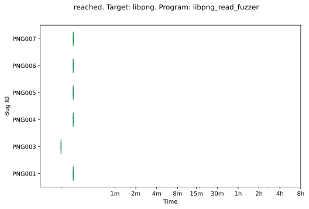
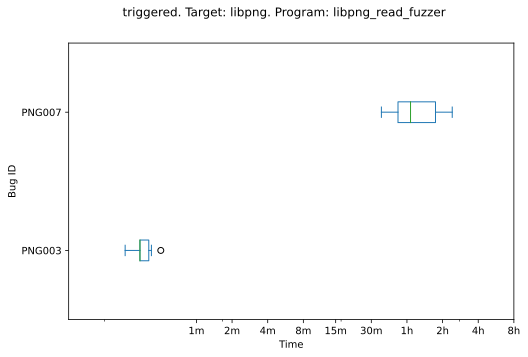
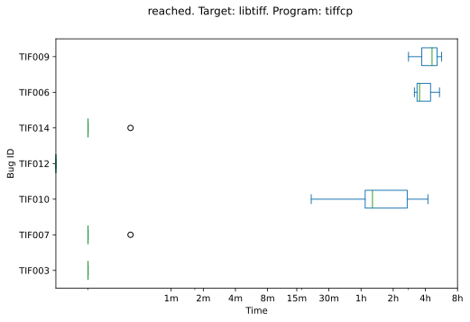
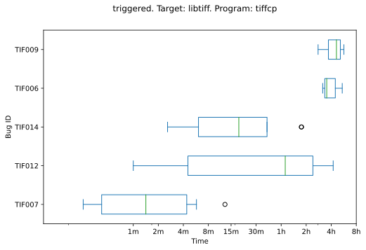
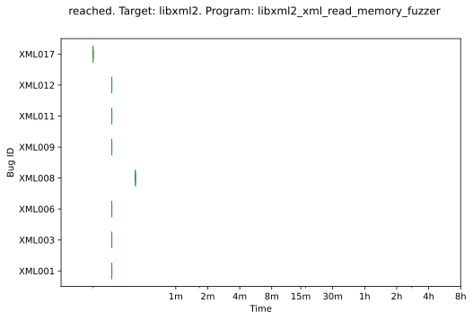
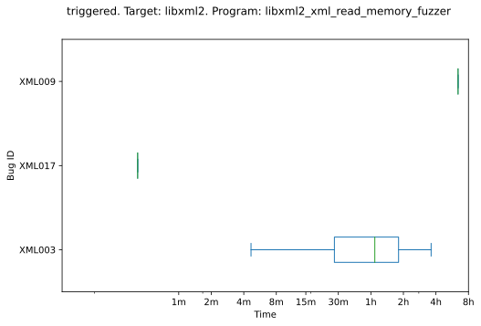
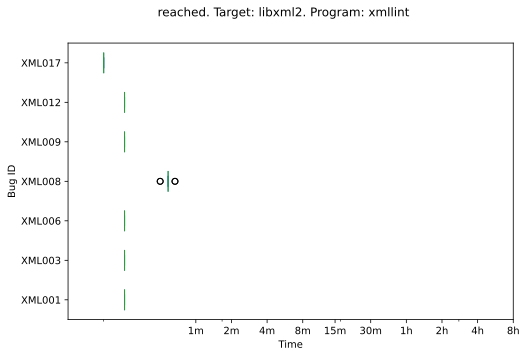
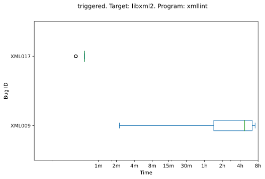



    <h1>pst_aflplusplus</h1>
    

        This page shows the distribution of time-to-bug measurements for every bug reached and/or triggered by the
        fuzzer. The results are grouped by target to highlight any performance trends the fuzzer may have against
        specific targets.
    

    <h2>libpng</h2>
        <h3>libpng_read_fuzzer</h3>
        

            

                
            

            

                
            

        

    <h2>libtiff</h2>
        <h3>tiffcp</h3>
        

            

                
            

            

                
            

        

    <h2>libxml2</h2>
        <h3>libxml2_xml_read_memory_fuzzer</h3>
        

            

                
            

            

                
            

        

        <h3>xmllint</h3>
        

            

                
            

            

                
            

        


{{ template | replace: '    ', ''}}
