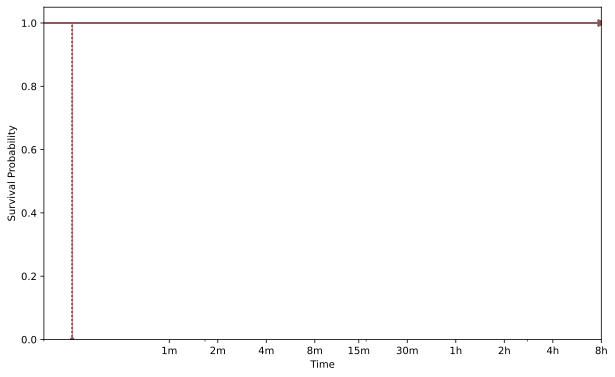
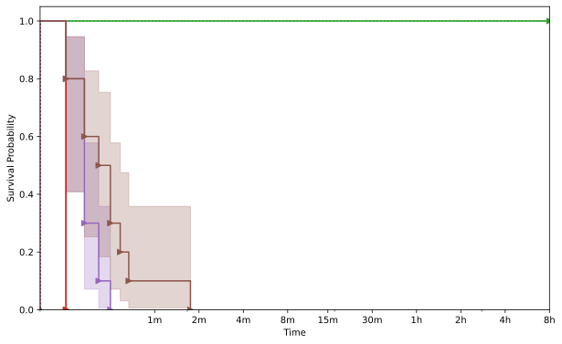
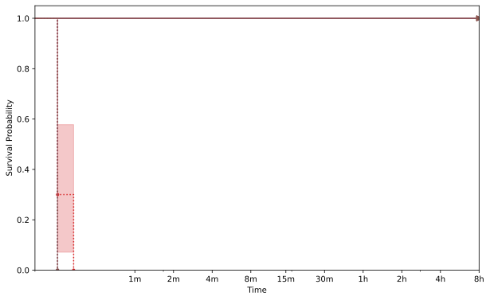
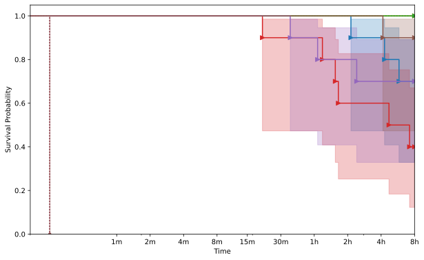



    <h1>libpng</h1>
    

        This page displays the aggregate information about the target as collected from the evaluation.
    

    

        

            
        

    

    
    <h2>libpng_read_fuzzer</h2>
    
        
    <h3>PNG001</h3>
    

        

            
        

    

    
        
    <h3>PNG003</h3>
    

        

            
        

    

    
        
    <h3>PNG004</h3>
    

        

            
        

    

    
        
    <h3>PNG005</h3>
    

        

            
        

    

    
        
    <h3>PNG006</h3>
    

        

            
        

    

    
        
    <h3>PNG007</h3>
    

        

            
        

    

    


{{ template | replace: '    ', ''}}
