

    <h1>libtiff</h1>
    

        This page displays the aggregate information about the target as collected from the evaluation.
    

    

        

            
        

    

    
    <h2>tiff_read_rgba_fuzzer</h2>
    
        
    <h3>TIF001</h3>
    

        

            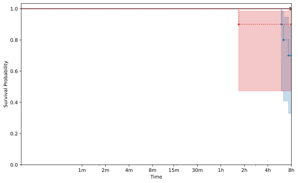
        

    

    
        
    <h3>TIF002</h3>
    

        

            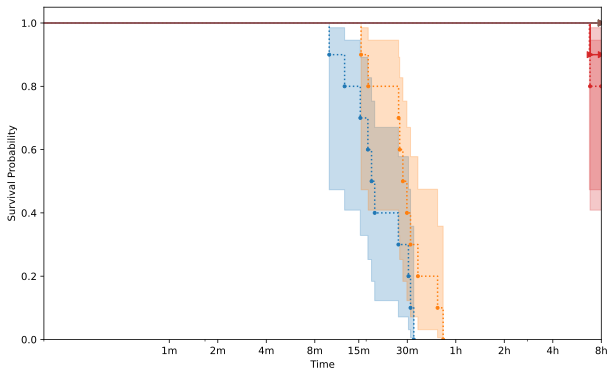
        

    

    
        
    <h3>TIF003</h3>
    

        

            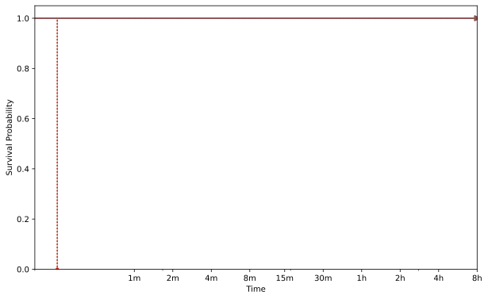
        

    

    
        
    <h3>TIF007</h3>
    

        

            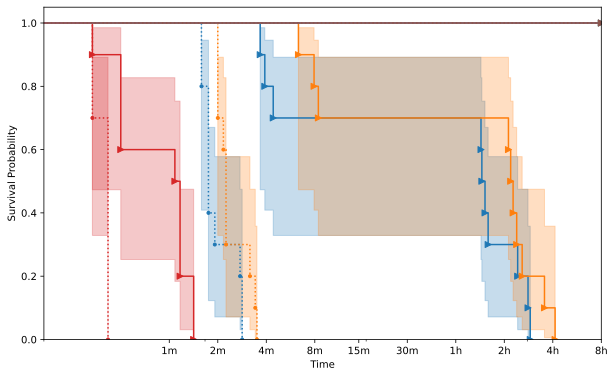
        

    

    
        
    <h3>TIF010</h3>
    

        

            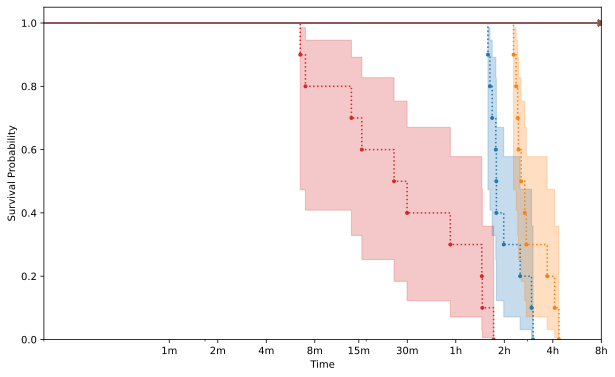
        

    

    
        
    <h3>TIF012</h3>
    

        

            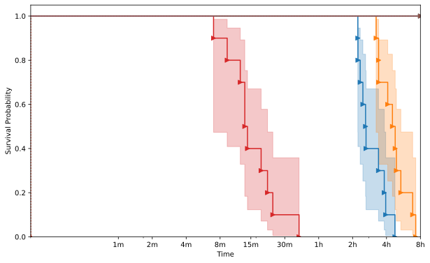
        

    

    
        
    <h3>TIF014</h3>
    

        

            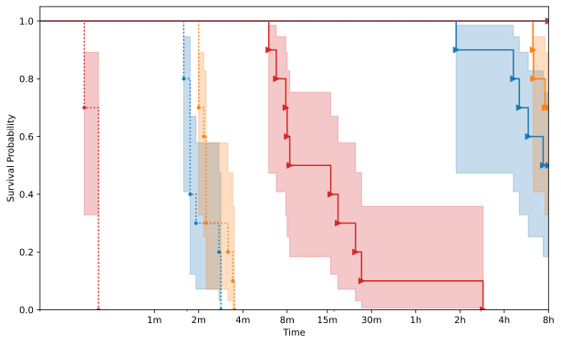
        

    

    

    
    <h2>tiffcp</h2>
    
        
    <h3>TIF002</h3>
    

        

            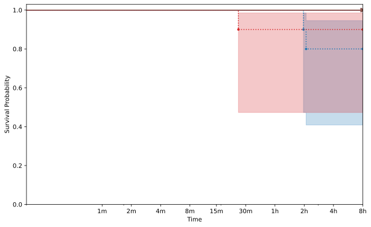
        

    

    
        
    <h3>TIF003</h3>
    

        

            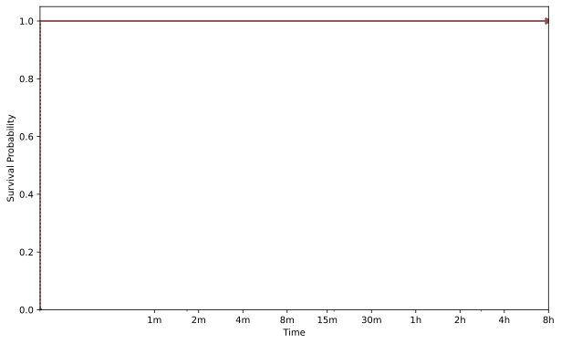
        

    

    
        
    <h3>TIF006</h3>
    

        

            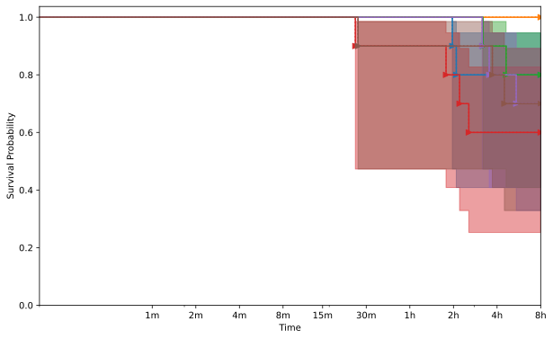
        

    

    
        
    <h3>TIF007</h3>
    

        

            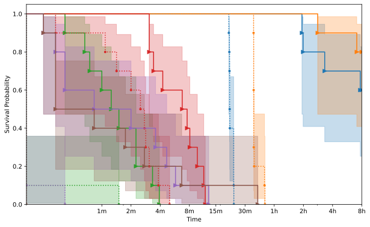
        

    

    
        
    <h3>TIF009</h3>
    

        

            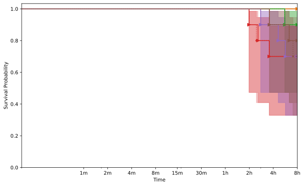
        

    

    
        
    <h3>TIF010</h3>
    

        

            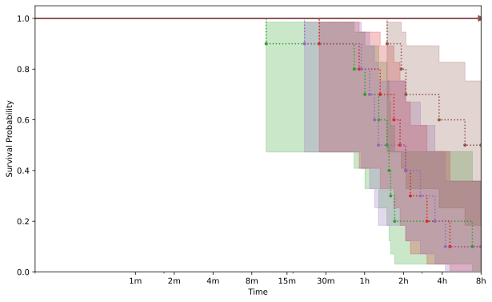
        

    

    
        
    <h3>TIF012</h3>
    

        

            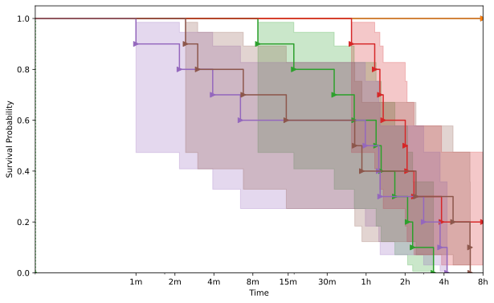
        

    

    
        
    <h3>TIF014</h3>
    

        

            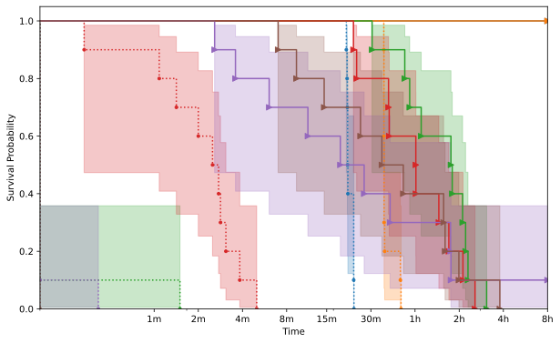
        

    

    


{{ template | replace: '    ', ''}}
