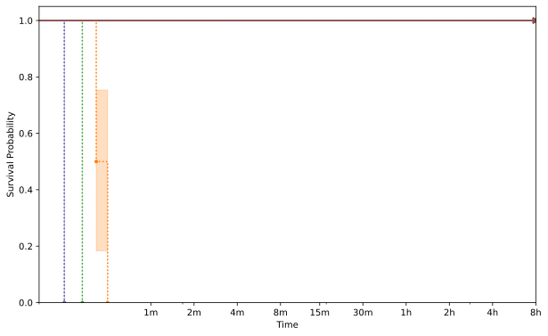



    <h1>libxml2</h1>
    

        This page displays the aggregate information about the target as collected from the evaluation.
    

    

        

            
        

    

    <h2>libxml2_xml_read_memory_fuzzer</h2>
    <h3>XML001</h3>
    

        

            
        

    

    <h3>XML003</h3>
    

        

            
        

    

    <h3>XML006</h3>
    

        

            
        

    

    <h3>XML008</h3>
    

        

            
        

    

    <h3>XML009</h3>
    

        

            
        

    

    <h3>XML011</h3>
    

        

            
        

    

    <h3>XML012</h3>
    

        

            
        

    

    <h3>XML017</h3>
    

        

            
        

    

    <h2>xmllint</h2>
    <h3>XML001</h3>
    

        

            
        

    

    <h3>XML003</h3>
    

        

            
        

    

    <h3>XML006</h3>
    

        

            
        

    

    <h3>XML008</h3>
    

        

            
        

    

    <h3>XML009</h3>
    

        

            
        

    

    <h3>XML012</h3>
    

        

            
        

    

    <h3>XML017</h3>
    

        

            
        

    


{{ template | replace: '    ', ''}}
